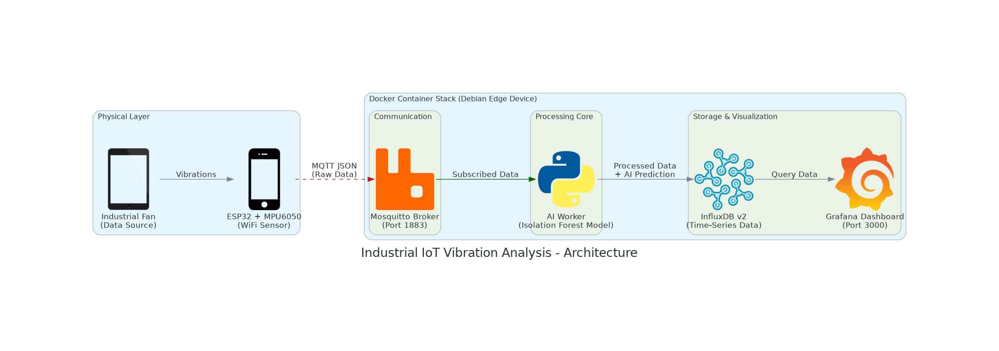

# Industrial IoT Vibration Analysis System with AI Anomaly Detection

[](https://opensource.org/licenses/MIT)


An end-to-end Industrial IoT (IIoT) solution for predictive maintenance. The system collects real-time vibration data from an ESP32 sensor, processes it using Python, utilizes an **Unsupervised Machine Learning model (Isolation Forest)** to detect anomalies on the edge, and visualizes the status in Grafana.



## 🚀 Features

* **Real-time Data Collection:** High-frequency sampling using MPU6050 accelerometer and ESP32 over MQTT.
* **Edge AI Computing:** Python worker running an **Isolation Forest** model to detect anomalies (vibrations deviating from the "normal" operational pattern) without needing labeled failure data.
* **Smart Filtering:** Logic gate (threshold for idle state) and debouncing filter (consecutive error count) to prevent false alarms.
* **Modern Tech Stack:** Fully containerized with Docker Compose (Mosquitto, InfluxDB v2, Grafana, Python Worker).
* **Live Dashboard:** Professional Grafana dashboard visualizing raw axes, vibration strength, and real-time AI status (OK/ALERT).

## 🛠️ Tech Stack & Hardware

### Hardware
* **Edge Device:** Debian-based mini PC / Server (hosting Docker)
* **Microcontroller:** ESP32 (using Arduino framework)
* **Sensor:** MPU6050 (Accelerometer + Gyroscope)
* **Target Machine:** Industrial Fan (for simulation)

### Software
* **Docker & Docker Compose:** Orchestration.
* **MQTT (Mosquitto):** Lightweight messaging protocol.
* **Python 3.9:** Data processing and ML.
    * `scikit-learn` (Isolation Forest)
    * `pandas`, `joblib`, `paho-mqtt`
* **InfluxDB v2:** Time-series database.
* **Grafana:** Visualization.

## ⚙️ Installation & Setup

1.  **Clone the repository:**
    ```bash
    git clone [https://github.com/Riskofpain/iiot-vibration-ai.git](https://github.com/Riskofpain/iiot-vibration-ai.git)
    cd iiot-vibration-ai
    ```

2.  **Environment Configuration:**
    Copy the example environment file and fill in your secrets (tokens, passwords).
    ```bash
    cp .env.example .env
    nano .env # Edit your secure credentials here
    ```

3.  **Build and Run the Stack:**
    ```bash
    docker compose up -d --build
    ```

4.  **AI Model Training (Initial Setup):**
    You need to train the model on your specific machine's "normal" behavior.
    * Stop the worker: `docker stop vibration-worker`
    * Enter `vibration-analysis` directory.
    * Run the logger while the machine is running normally: `python3 logger.py` (record for ~2-3 mins).
    * Train the model: `python3 train.py`.
    * Rebuild the worker container to apply the new model:
        ```bash
        cd ..
        docker compose up -d --build vibration-worker
        ```

5.  **Access Dashboards:**
    * **Grafana:** `http://YOUR_IP:3000` (Default login: admin/admin)
    * **InfluxDB UI:** `http://YOUR_IP:8087`
